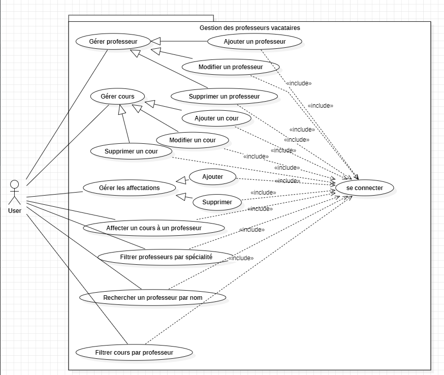
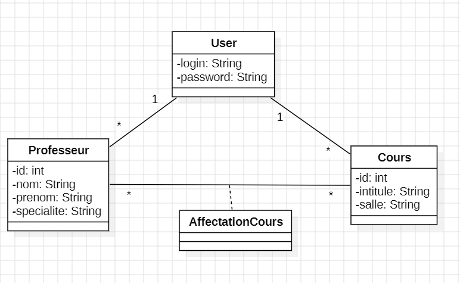
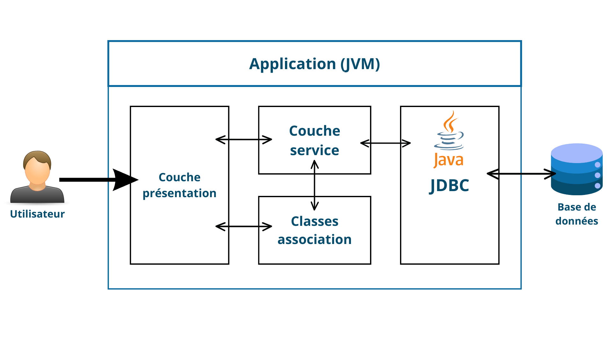

# Projet de gestion des professeurs vacataires

## Contexte
Ce projet est une application Java qui permet de gérer l'affectation des cours aux professeurs vacataires.  
L'interface utilisateur est développée avec **Swing**, et la base de données est gérée avec **MySQL**.

## Problématique
Dans les établissements scolaires et universitaires, la gestion de l’affectation des cours aux professeurs
est souvent un processus complexe et chronophage. Le suivi des cours, l’organisation des emplois du temps
et la gestion des ressources (salles, spécialités, etc.) sont des défis majeurs.
L'absence d'un système informatisé peut entraîner des erreurs, des conflits d'horaires et une perte
de temps dans la gestion administrative. Comment concevoir une application permettant d'automatiser
et d’optimiser l’affectation des cours aux professeurs tout en assurant une gestion efficace et intuitive ?

## Objectif
L’objectif principal de ce projet est de développer une application de gestion des affectations de cours aux professeurs, permettant :
 -L'ajout, la modification et la suppression des professeurs et des cours
 -L'affectation des cours aux enseignants
 -L'affichage des cours attribués à chaque professeur
 -Une interface intuitive et facile d'utilisation
Ce projet vise à améliorer l’efficacité du processus administratif et à réduire les erreurs liées à la planification des cours.
## Diagramme de cas d'utilisation


## Diagramme de classe 


## Les tables
Professeur (id, nom, prénom, spécialité)

Cours (id, intitule, salle)

AffectationCours (professeur_id, cours_id)

## La base de donnees avec MySQL
```sql
__La table Cours:
CREATE TABLE Cours (
    id INT AUTO_INCREMENT PRIMARY KEY,
    intitule VARCHAR(25) NOT NULL,
    salle VARCHAR(25) NOT NULL
);
__La table Professeur:
CREATE TABLE Professeur (
id INT AUTO_INCREMENT PRIMARY KEY, 
nom VARCHAR(25) NOT NULL, 
prenom VARCHAR(25) NOT NULL, 
specialite VARCHAR(25) NOT NULL
); 
__La table AffectationCours:
CREATE TABLE AffectationCours (
    professeur_id INT NOT NULL,
    cours_id INT NOT NULL,
    PRIMARY KEY (professeur_id, cours_id),
    FOREIGN KEY (professeur_id) REFERENCES Professeur(id) ON DELETE CASCADE,
    FOREIGN KEY (cours_id) REFERENCES Cours(id) ON DELETE CASCADE
);
__La table User:
CREATE TABLE User (
    login VARCHAR(255) PRIMARY KEY,
    password VARCHAR(255) NOT NULL,
    questionSecurit VARCHAR(255),
    reponseSecurit VARCHAR(255),
    email VARCHAR(255)
);
```
## Architecture 


## Technologies utilisées
Java (Swing)

MySQL (JDBC) Gérer par : phpMyAdmin

Outils de développement : NetBeans (IDE Java)

GitHub pour le versioning
 
## Démo vidéo 


