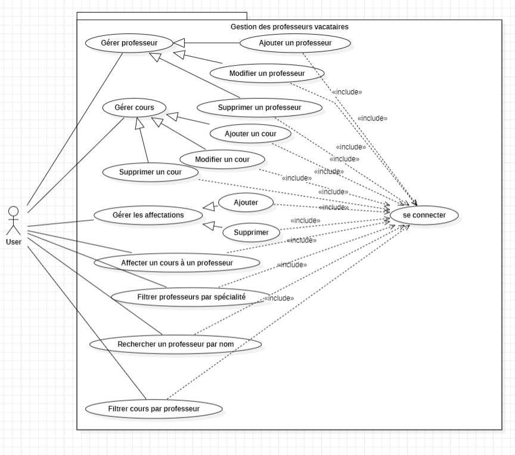
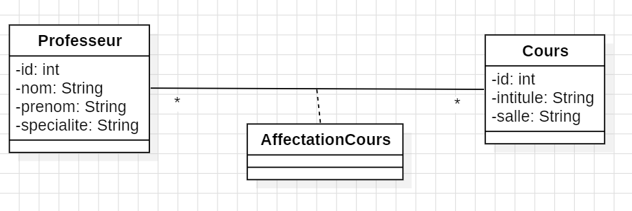
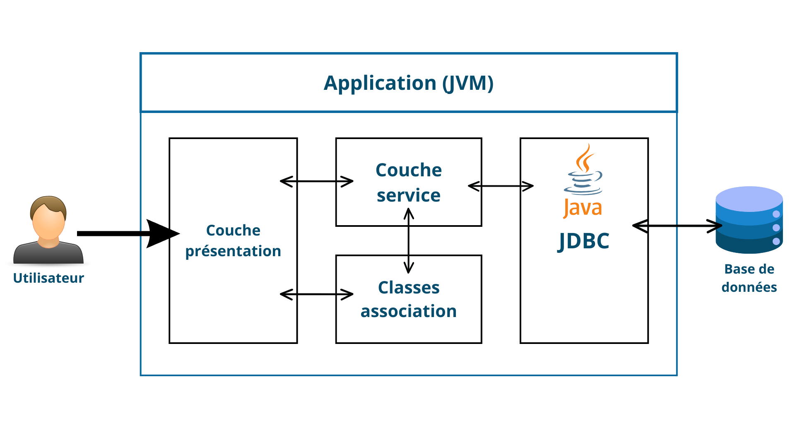
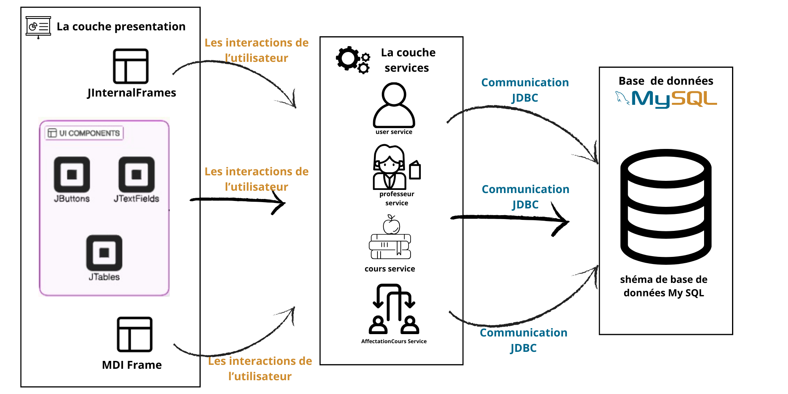

# 📚 Projet de gestion des professeurs vacataires


## 📋 Sommaire

- [Contexte](#-contexte)
- [Problématique](#-problématique)
- [Objectifs](#-objectifs)
- [Diagramme de cas d'utilisation](#-diagramme-de-cas-dutilisation)
- [Diagramme de classes](#-diagramme-de-classes)
- [Structure de la base de données](#-structure-de-la-base-de-données)
- [Architecture](#-architecture)
- [Technologies utilisées](#-technologies-utilisées)
- [Installation et exécution](#-installation-et-exécution)
- [Démo vidéo](#-démo-vidéo)


## 🗂️ Contexte
Ce projet est une application **Java Swing** permettant de gérer l'affectation des cours aux professeurs vacataires. La base de données est gérée avec **MySQL**.

## 📌 Problématique
Dans les établissements scolaires et universitaires, la gestion de l’affectation des cours aux professeurs est souvent un processus complexe et chronophage. 

Sans un système informatisé, cela peut entraîner :
- Des erreurs dans la planification des cours.
- Des conflits d'horaires.
- Une perte de temps dans la gestion administrative.

**Comment automatiser et optimiser l’affectation des cours aux professeurs tout en garantissant une gestion intuitive et efficace ?**

## 🎯 Objectifs
L’objectif principal de ce projet est de développer une application permettant :

- ✅ L'ajout, la modification et la suppression des professeurs et des cours.
- ✅ L'affectation des cours aux professeurs.
- ✅ L'affichage des cours attribués à chaque professeur.
- ✅ Une interface utilisateur intuitive et facile à prendre en main.

Ce projet vise à améliorer l’efficacité du processus administratif et à réduire les erreurs liées à la planification.

## 📊 Diagramme de cas d'utilisation


## 📐 Diagramme de classes


## 📖 Structure de la base de données

### 1. Table `Professeur`
```sql
CREATE TABLE Professeur (
    id INT AUTO_INCREMENT PRIMARY KEY,
    nom VARCHAR(25) NOT NULL,
    prenom VARCHAR(25) NOT NULL,
    specialite VARCHAR(25) NOT NULL
);
```

### 2. Table `Cours`
```sql
CREATE TABLE Cours (
    id INT AUTO_INCREMENT PRIMARY KEY,
    intitule VARCHAR(25) NOT NULL,
    salle VARCHAR(25) NOT NULL
);
```

### 3. Table `AffectationCours`
```sql
CREATE TABLE AffectationCours (
    professeur_id INT NOT NULL,
    cours_id INT NOT NULL,
    PRIMARY KEY (professeur_id, cours_id),
    FOREIGN KEY (professeur_id) REFERENCES Professeur(id) ON DELETE CASCADE,
    FOREIGN KEY (cours_id) REFERENCES Cours(id) ON DELETE CASCADE
);
```

### 4. Table `User` (Gestion de l'authentification)
```sql
CREATE TABLE User (
    login VARCHAR(255) PRIMARY KEY,
    password VARCHAR(255) NOT NULL,
    questionSecurit VARCHAR(255),
    reponseSecurit VARCHAR(255),
    email VARCHAR(255)
);
```

## 🏛️ Architecture



## 🛠️ Technologies utilisées
- **Langage** : Java (Swing)
- **Base de données** : MySQL (JDBC) – Géré via **phpMyAdmin**
- **Environnement de développement** : NetBeans 8.0.2
- **Versioning** : GitHub

## 🚀 Installation et exécution


## 🎥 Démo vidéo
👉 https://github.com/user-attachments/assets/30a1642a-030e-4f21-922b-2f3c35a7d5e9

---

**📝 Remarque :** Ce projet est en développement actif. Toute contribution est la bienvenue !

